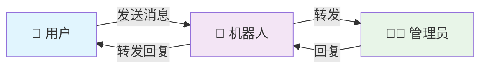

# 📱 cftgsx - Telegram 双向消息转发机器人

<div align="center">


**高性能、无状态、开箱即用的Telegram双向消息转发解决方案**

[🚀 快速开始](#-快速开始) • [📖 文档](#-使用方法) • [🛠️ 部署](#-部署步骤) • [🤝 贡献](#-贡献指南)

</div>

## 📸 项目演示

<div align="center">

### 🔄 消息转发流程



### ✨ 功能特色

| 🚀 高性能 | 🛡️ 可靠性 | 🧹 简洁性 |
|:---:|:---:|:---:|
| 毫秒级响应 | 99.9%可用性 | 单文件部署 |
| 后台处理 | 自动重试 | 零配置启动 |
| 无状态设计 | 错误监控 | 易于维护 |

</div>

---

## 🌟 项目亮点

这是一个基于**Cloudflare Workers**的高性能Telegram双向消息转发机器人，采用无状态设计，支持用户消息转发给管理员，并允许管理员直接回复。

### ⭐ 为什么选择这个项目？

- 🔥 **零成本部署** - 基于Cloudflare Workers免费额度
- ⚡ **极速响应** - 后台处理，毫秒级响应
- 🛡️ **高可靠性** - 完善错误处理，自动监控
- 🧹 **代码简洁** - 函数式架构，易于维护
- 📦 **开箱即用** - 单文件部署，配置简单

## 📋 功能特性

<table>
<tr>
<td width="50%">

**🔄 核心功能**
- ✅ 双向消息转发
- ✅ 多媒体消息支持
- ✅ 用户信息展示
- ✅ 即时确认回复

</td>
<td width="50%">

**⚡ 技术特性**
- ✅ 无状态设计
- ✅ 后台异步处理
- ✅ 完善错误监控
- ✅ 安全验证机制

</td>
</tr>
</table>

### 💬 使用场景

- 📞 **客服系统** - 个人/小团队客服消息处理
- 🔗 **消息中转** - 不同用户群体间的消息桥接  
- 📱 **通知转发** - 将系统通知转发到个人聊天
- 🤖 **Bot集成** - 作为其他系统的消息接口

## 🚀 快速开始

### 📋 前置要求

- [Cloudflare账号](https://dash.cloudflare.com/sign-up) (免费)
- [Telegram Bot Token](https://t.me/BotFather) 
- 管理员的Telegram Chat ID

### ⚡ 一键部署

1. **获取Bot Token**
   ```bash
   # 1. 在Telegram中找到 @BotFather
   # 2. 发送 /newbot 创建机器人
   # 3. 记录返回的Bot Token
   ```

2. **获取Chat ID**
   ```bash
   # 方法1: 使用 @userinfobot 获取你的Chat ID
   # 方法2: 发消息给bot后访问 https://api.telegram.org/bot<TOKEN>/getUpdates
   ```

3. **部署到Cloudflare**
   - 复制 `worker.js` 内容到Cloudflare Workers编辑器
   - 设置环境变量 (见下方配置)
   - 访问 `/setWebhook` 端点完成配置

就是这么简单！🎉

## 🛠️ 部署步骤

### 步骤1: 创建Telegram机器人

<details>
<summary>📱 点击展开详细步骤</summary>

1. 在Telegram中搜索 `@BotFather`
2. 发送 `/newbot` 命令
3. 按提示设置机器人名称和用户名
4. 保存返回的Bot Token

```
示例输出:
Use this token to access the HTTP API:
1234567890:AAAA-BBBBBBBBBBBBBBBBBBBBBBBBBB
```

</details>

### 步骤2: 获取管理员Chat ID

<details>
<summary>🆔 点击展开获取方法</summary>

**方法1 (推荐)**: 使用 @userinfobot
```
1. 在Telegram中搜索 @userinfobot
2. 发送 /start
3. 记录显示的Chat ID
```

**方法2**: 通过API获取
```
1. 向你的机器人发送任意消息
2. 访问: https://api.telegram.org/bot<YOUR_BOT_TOKEN>/getUpdates
3. 在返回的JSON中找到 "chat":{"id": 123456789}
```

</details>

### 步骤3: 部署到Cloudflare Workers

<details>
<summary>☁️ 点击展开部署步骤</summary>

1. **创建Worker**
   - 访问 [Cloudflare Workers](https://workers.cloudflare.com/)
   - 点击 "Create a Service"
   - 输入服务名称（如：`telegram-bot`）

2. **配置代码**
   - 删除默认代码
   - 复制粘贴 [`worker.js`](./worker.js) 的全部内容
   - 点击 "Save and Deploy"

3. **设置环境变量**
   
   在Worker设置页面添加以下变量：
   
   | 变量名 | 值 | 必需 |
   |--------|-----|------|
   | `BOT_TOKEN` | 你的Bot Token | ✅ |
   | `ADMIN_CHAT_ID` | 管理员Chat ID | ✅ |
   | `WEBHOOK_SECRET` | 自定义密钥 | ❌ |

4. **设置Webhook**
   ```bash
   # 访问这个URL完成设置
   https://your-worker.your-subdomain.workers.dev/setWebhook
   ```

✅ **成功响应示例**:
```json
{
  "ok": true,
  "result": true,
  "description": "Webhook was set"
}
```

</details>

### 🎉 完成！

现在你的机器人已经可以正常工作了：
- 用户发送消息会自动转发给管理员
- 管理员回复转发的消息即可回复给用户

## 📖 使用方法

### 👤 用户端操作

```bash
/start                    # 开始对话，显示欢迎信息
发送任意消息               # 自动转发给管理员
等待管理员回复             # 收到管理员的回复消息
```

### 👨‍💼 管理员操作

```bash
/start                    # 显示管理员控制面板
/status                   # 查看机器人运行状态  
/help                     # 获取帮助信息
回复转发的消息             # 直接回复给对应用户
```

### 🤖 机器人命令

| 命令 | 适用对象 | 功能描述 |
|------|---------|----------|
| `/start` | 全部 | 显示欢迎信息或管理面板 |
| `/status` | 管理员 | 查看机器人运行状态 |
| `/help` | 管理员 | 显示详细帮助信息 |

## 📁 项目结构

```
cftgsx/
├── 📄 worker.js                 # 主程序文件 (单文件部署)
├── 📄 README.md                 # 项目说明文档
├── 📄 LICENSE                   # MIT开源协议
└── 📄 .gitignore               # Git忽略文件
```

## 🔧 API端点

| 端点 | 方法 | 描述 |
|------|------|------|
| `/webhook` | POST | Telegram Webhook接收端点 |
| `/setWebhook` | GET | 设置Telegram Webhook |
| `/me` | GET | 获取机器人信息 |
| `/` | GET | 健康检查 |

## 🧪 测试验证

### ✅ 基本功能测试

<details>
<summary>点击查看测试步骤</summary>

1. **用户消息测试**
   ```bash
   用户: /start
   期望: 收到欢迎消息
   
   用户: 发送测试消息
   期望: 管理员收到转发消息
   ```

2. **管理员回复测试**
   ```bash
   管理员: 回复转发消息
   期望: 用户收到回复
   ```

3. **管理员命令测试**
   ```bash
   管理员: /status
   期望: 显示机器人状态
   
   管理员: /help
   期望: 显示帮助信息
   ```

</details>

### 🔍 状态检查

| 检查项 | URL | 期望结果 |
|--------|-----|----------|
| 健康检查 | `https://your-worker.workers.dev/` | `Telegram Bot is running!` |
| 机器人信息 | `https://your-worker.workers.dev/me` | 返回机器人详细信息 |
| Webhook状态 | `https://your-worker.workers.dev/setWebhook` | `{"ok": true, ...}` |

## ❓ 常见问题

<details>
<summary><strong>Q: 机器人没有响应？</strong></summary>

**可能原因：**
- ❌ Bot Token错误或无效
- ❌ 环境变量设置不正确  
- ❌ Webhook未设置成功

**解决方案：**
1. 检查环境变量 `BOT_TOKEN` 是否正确
2. 访问 `/me` 端点验证Token有效性
3. 重新访问 `/setWebhook` 设置Webhook
4. 查看Worker日志确认错误信息

</details>

<details>
<summary><strong>Q: 管理员收不到用户消息？</strong></summary>

**可能原因：**
- ❌ `ADMIN_CHAT_ID` 设置错误
- ❌ 管理员未先与机器人对话

**解决方案：**
1. 确认 `ADMIN_CHAT_ID` 数值正确
2. 管理员先向机器人发送 `/start`
3. 检查Worker日志中的转发记录

</details>

<details>
<summary><strong>Q: 用户收不到管理员回复？</strong></summary>

**可能原因：**
- ❌ 管理员未回复带有用户标识的消息
- ❌ 用户ID解析失败

**解决方案：**
1. 确保回复的是转发消息，而非普通消息
2. 检查转发消息是否包含 `[USER:xxxxx]` 标识
3. 查看Worker日志确认回复发送状态

</details>

### 📊 日志查看

在Cloudflare Workers控制台查看实时日志：
```
Workers → 你的Worker → Logs 标签
```

## ⚠️ 使用限制

### 技术限制

- **并发处理**: Cloudflare Workers免费版有并发限制 (1000 requests/min)
- **消息大小**: 受Telegram API限制（文件最大50MB）  
- **存储**: 无持久化存储，适合消息转发场景
- **功能**: 专注消息转发，不支持群聊管理等复杂功能

### 💡 解决方案

- **高并发**: 升级Cloudflare Workers套餐
- **大文件**: 使用文件压缩或分片上传
- **数据存储**: 集成KV存储实现持久化（如需要）

---

## 🤝 贡献指南

欢迎提交Issue和Pull Request！

### 🔧 开发环境设置

1. **克隆项目**
   ```bash
   git clone https://github.com/SCSHIRKER/cftgsx.git
   cd cftgsx
   ```

2. **本地测试**
   ```bash
   # 使用 Wrangler CLI 进行本地开发
   npm install -g wrangler
   wrangler dev
   ```

3. **代码风格**
   - 使用ES6+语法
   - 函数式编程优先
   - 添加适当的错误处理
   - 保持代码简洁明了

### 📝 提交规范

- 🐛 `fix:` 修复Bug
- ✨ `feat:` 新功能
- 📚 `docs:` 文档更新
- 🎨 `style:` 代码格式
- ♻️ `refactor:` 代码重构
- ⚡ `perf:` 性能优化
- 🧪 `test:` 测试相关

### 🚀 发布版本

项目采用最新的Cloudflare Workers最佳实践进行优化。

## 📝 更新日志

### v1.0.0 (Latest)
- 🎉 首次发布
- ✨ 双向消息转发功能
- ⚡ 无状态高性能设计
- 🛡️ 完善错误处理机制
- 📦 单文件部署方案
- 🔧 管理员命令支持

### 🔮 计划中功能
- [ ] 群聊消息转发支持
- [ ] 消息过滤和规则配置
- [ ] 数据统计和分析面板
- [ ] 多管理员支持
- [ ] 消息模板和自动回复

## 📄 许可证

本项目采用 [MIT License](./LICENSE) 开源协议。

```
MIT License - 可自由使用、修改、分发
```

## 🙏 致谢

- 感谢 [Cloudflare Workers](https://workers.cloudflare.com/) 提供的优秀Serverless平台
- 感谢 [Telegram Bot API](https://core.telegram.org/bots/api) 的强大功能
- 感谢所有贡献者和使用者的支持

## 📞 支持

如果这个项目对你有帮助，请考虑：

- ⭐ 给项目加个Star
- 🐛 报告Bug或提出建议
- 📢 推荐给其他人
- 🤝 参与项目贡献

## 🔗 相关链接

- [Cloudflare Workers 文档](https://developers.cloudflare.com/workers/)
- [Telegram Bot API 文档](https://core.telegram.org/bots/api)
- [GitHub仓库](https://github.com/SCSHIRKER/cftgsx)

---

<div align="center">

**🤖 让消息转发变得简单高效！**

Made with ❤️ by developers, for developers.

</div> 